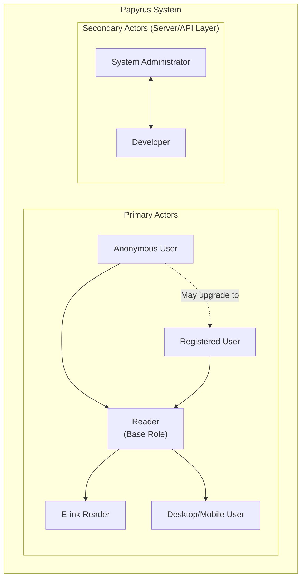

# Actors

This section defines the user types that interact with Papyrus. Each actor represents a distinct user group with specific needs, goals, and interaction patterns.

## Actor Summary

| Actor | Type | Description | Key Use Cases |
|-------|------|-------------|---------------|
| Reader | Primary | Core user who reads and manages books | UC-2.x, UC-3.x, UC-4.x, UC-5.x |
| Anonymous User | Primary | Uses app without account (offline mode) | UC-1.4, UC-2.x, UC-3.x |
| Registered User | Primary | Has account for sync and cloud features | UC-1.x, UC-7.x |
| E-ink Reader | Primary | Uses dedicated e-reader devices | UC-3.x (reading-focused) |
| System Administrator | Secondary | Manages self-hosted server instances | UC-7.1 |
| Developer | Secondary | Integrates via API or builds extensions | API access |

---

## Primary Actors

### Reader

The core user of Papyrus who uses the application for reading and managing their book collection.

**Profile:**

- Regularly consumes digital and/or physical books
- Uses multiple devices (phone, tablet, computer, e-reader)
- Values a seamless reading experience across platforms
- Technical expertise ranges from beginner to advanced

**Goals:**

- Read books comfortably on any device
- Organize and manage book collections efficiently
- Track reading progress and build reading habits
- Take notes and highlights while reading
- Achieve personal reading goals

**Primary Use Cases:**

- [UC-2.1](use-cases.md#uc-21-import-book-files) Import book files
- [UC-2.4](use-cases.md#uc-24-organize-books-into-shelves) Organize books into shelves
- [UC-2.5](use-cases.md#uc-25-tag-books) Tag books
- [UC-2.6](use-cases.md#uc-26-search-books) Search books
- [UC-3.1](use-cases.md#uc-31-read-books-with-integrated-viewer) Read with integrated viewer
- [UC-3.2](use-cases.md#uc-32-customize-reading-experience) Customize reading experience
- [UC-4.1](use-cases.md#uc-41-create-text-annotations) Create annotations
- [UC-5.1](use-cases.md#uc-51-track-reading-progress) Track reading progress
- [UC-6.1](use-cases.md#uc-61-create-reading-goals) Create reading goals

**Requirements Addressed:**

- FR-2.x (Book Management)
- FR-3.x (Integrated Viewer)
- FR-4.x (Annotations and Notes)
- FR-5.x (Progress Tracking)
- FR-6.x (Goal Management)

---

### Anonymous User

A user who accesses Papyrus without creating an account, using the application entirely in offline mode.

**Profile:**

- Privacy-conscious individuals who avoid cloud services
- Users evaluating the application before committing
- Users in areas with limited or unreliable internet
- Users who prefer complete data control

**Goals:**

- Use all reading features without registration
- Maintain complete privacy and local data control
- Access the application without internet dependency
- Optionally convert to registered user later without data loss

**Constraints:**

- No cross-device synchronization
- No cloud storage options
- All data stored locally on device
- Must manually transfer data between devices

**Primary Use Cases:**

- [UC-1.4](use-cases.md#uc-14-use-application-offline) Use application offline
- [UC-2.1](use-cases.md#uc-21-import-book-files) Import book files
- [UC-3.1](use-cases.md#uc-31-read-books-with-integrated-viewer) Read books
- [UC-2.7](use-cases.md#uc-27-export-books-and-data) Export books and data

**Requirements Addressed:**

- FR-1.4 (Offline Mode)
- NFR-2.1 (Online/Offline Parity)
- NFR-6.5 (No Default Analytics)

---

### Registered User

A user with an account who can access synchronization and cloud features.

**Profile:**

- Users who want cross-device synchronization
- Users with multiple reading devices
- Users who value cloud backup and recovery
- May use official cloud or self-hosted server

**Goals:**

- Synchronize library and progress across all devices
- Back up reading data securely
- Access books from anywhere
- Recover data if device is lost

**Primary Use Cases:**

- [UC-1.1](use-cases.md#uc-11-create-user-account) Create user account
- [UC-1.2](use-cases.md#uc-12-login-with-credentials) Login with credentials
- [UC-1.3](use-cases.md#uc-13-login-with-google-account) Login with Google
- [UC-1.5](use-cases.md#uc-15-recover-password) Recover password
- [UC-7.1](use-cases.md#uc-71-configure-storage-options) Configure storage
- [UC-7.3](use-cases.md#uc-73-synchronize-data-across-devices) Synchronize data

**Requirements Addressed:**

- FR-1.x (User Management)
- FR-5.3 (Cross-Device Sync)
- FR-7.1 (Storage Options)
- NFR-2.x (Synchronization)

---

### E-ink Reader

A user who primarily reads on dedicated e-ink devices (Kindle, Kobo, reMarkable, etc.).

**Profile:**

- Owns one or more e-ink reading devices
- Values long reading sessions with minimal eye strain
- May have limited device capabilities (grayscale, slower refresh)
- Prefers distraction-free reading environment

**Goals:**

- Comfortable extended reading sessions
- Optimized UI for e-ink display characteristics
- Minimal battery consumption
- Fast page turns with reduced screen flashing

**Specific Needs:**

- High contrast, grayscale-optimized interface
- Reduced or disabled animations
- Simplified navigation for slower displays
- Large, clear touch targets
- Support for hardware buttons (page turn)

**Primary Use Cases:**

- [UC-3.1](use-cases.md#uc-31-read-books-with-integrated-viewer) Read books (primary focus)
- [UC-3.2](use-cases.md#uc-32-customize-reading-experience) Customize reading experience
- [UC-3.3](use-cases.md#uc-33-manage-reading-profiles) Manage reading profiles
- [UC-4.1](use-cases.md#uc-41-create-text-annotations) Create annotations

**Requirements Addressed:**

- NFR-3.4 (E-Reader Support)
- NFR-5.2 (Accessibility)
- FR-3.2 (Viewer Customization)
- FR-3.3 (Reading Profiles)

---

## Secondary Actors

### System Administrator

A technical user responsible for deploying and maintaining self-hosted Papyrus server instances.

**Profile:**

- Technical expertise in server administration
- Manages Papyrus for personal use or organizations
- Responsible for security and maintenance
- Familiar with Docker, databases, networking

**Goals:**

- Deploy Papyrus server with minimal friction
- Ensure system security and data protection
- Monitor performance and resource usage
- Manage user accounts (for organization deployments)
- Perform backups and disaster recovery

**Interactions:**

- Server installation via Docker/Docker Compose
- Database configuration and maintenance
- Storage backend setup (local, MinIO, S3)
- SSL/TLS certificate management
- User account administration
- Log monitoring and troubleshooting

**Requirements Addressed:**

- NFR-7.1 (Uptime)
- NFR-7.4 (Backup/Restore)
- NFR-1.2 (Storage Backends)
- NFR-6.x (Security)

---

### Developer

A technical user who integrates with Papyrus via API or develops extensions.

**Profile:**

- Software developers and system integrators
- Plugin/extension developers
- Third-party service providers
- Researchers and data analysts

**Goals:**

- Integrate Papyrus with other systems
- Build custom clients or frontends
- Develop plugins for extended functionality
- Export/analyze reading data programmatically

**Interactions:**

- REST API authentication and usage
- API documentation (OpenAPI/Swagger)
- Plugin development framework
- Data export formats (JSON, CSV)
- Webhook integrations

**Requirements Addressed:**

- FR-7.4 (Plugin System)
- NFR-8.1 (Extensibility)

---

## Actor Relationships

**Key Relationships:**

- Anonymous User can upgrade to Registered User while preserving data
- Reader is the base role; Anonymous, Registered, and E-ink Reader inherit capabilities
- E-ink Reader is a specialized form of Reader with specific UI requirements
- System Administrator manages the infrastructure that Registered Users depend on
- Developer interacts with the system programmatically via API
