# Database model

This section presents the database schema for Papyrus, showing table structures, relationships, constraints, and design principles.

## Schema overview

The database consists of 16 tables organized into functional groups:

| Group | Tables |
|-------|--------|
| **User Management** | USER |
| **Book Management** | BOOK, SHELF, TAG, SERIES |
| **Reading Experience** | ANNOTATION, NOTE, BOOKMARK |
| **Progress & Goals** | READING_SESSION, READING_GOAL |
| **Configuration** | READING_PROFILE, METADATA_SERVER_CONFIG, FILE_STORAGE_BACKEND, SAVED_FILTER |
| **Junction Tables** | BOOK_SHELF, BOOK_TAG |

---

## Entity relationship diagram

```mermaid
erDiagram
    USER {
        uuid user_id PK
        varchar email UK
        varchar password_hash
        varchar display_name
        varchar avatar_url
        varchar google_id UK
        boolean is_anonymous
        boolean is_active
        boolean email_verified
        timestamp created_at
        timestamp updated_at
        timestamp last_login_at
        jsonb preferences
    }

    BOOK {
        uuid book_id PK
        uuid user_id FK
        varchar title
        varchar subtitle
        varchar author
        jsonb co_authors
        varchar isbn
        varchar isbn13
        date publication_date
        varchar publisher
        varchar language
        integer page_count
        text description
        varchar cover_image_url
        uuid series_id FK
        decimal series_number
        varchar file_path
        varchar file_format
        bigint file_size
        varchar file_hash
        uuid storage_backend_id FK
        boolean is_physical
        varchar physical_location
        varchar lent_to
        timestamp lent_at
        boolean is_favorite
        smallint rating
        varchar reading_status
        integer current_page
        decimal current_position
        varchar current_cfi
        timestamp started_at
        timestamp completed_at
        timestamp added_at
        timestamp last_read_at
        jsonb custom_metadata
        boolean is_ocr_processed
        decimal ocr_confidence
    }

    SHELF {
        uuid shelf_id PK
        uuid user_id FK
        uuid parent_shelf_id FK
        varchar name
        text description
        varchar color
        varchar icon
        boolean is_default
        boolean is_smart
        varchar smart_query
        integer sort_order
        timestamp created_at
        timestamp updated_at
    }

    TAG {
        uuid tag_id PK
        uuid user_id FK
        varchar name
        varchar color
        text description
        integer usage_count
        timestamp created_at
    }

    SERIES {
        uuid series_id PK
        uuid user_id FK
        varchar name
        text description
        varchar author
        integer total_books
        boolean is_complete
        timestamp created_at
        timestamp updated_at
    }

    ANNOTATION {
        uuid annotation_id PK
        uuid book_id FK
        uuid user_id FK
        text selected_text
        text note
        varchar highlight_color
        varchar start_position
        varchar end_position
        varchar chapter_title
        integer chapter_index
        integer page_number
        timestamp created_at
        timestamp updated_at
    }

    NOTE {
        uuid note_id PK
        uuid book_id FK
        uuid user_id FK
        varchar title
        text content
        boolean is_pinned
        timestamp created_at
        timestamp updated_at
    }

    BOOKMARK {
        uuid bookmark_id PK
        uuid book_id FK
        uuid user_id FK
        varchar position
        integer page_number
        varchar chapter_title
        varchar note
        varchar color
        timestamp created_at
    }

    READING_SESSION {
        uuid session_id PK
        uuid book_id FK
        uuid user_id FK
        timestamp start_time
        timestamp end_time
        decimal start_position
        decimal end_position
        integer pages_read
        integer duration_minutes
        varchar device_type
        varchar device_name
        timestamp created_at
    }

    READING_GOAL {
        uuid goal_id PK
        uuid user_id FK
        varchar title
        text description
        varchar goal_type
        integer target_value
        integer current_value
        varchar time_period
        date start_date
        date end_date
        boolean is_active
        boolean is_completed
        timestamp completed_at
        timestamp created_at
        timestamp updated_at
    }

    READING_PROFILE {
        uuid profile_id PK
        uuid user_id FK
        varchar name
        boolean is_default
        varchar font_family
        smallint font_size
        smallint font_weight
        decimal line_height
        decimal letter_spacing
        decimal paragraph_spacing
        varchar text_align
        smallint margin_horizontal
        smallint margin_vertical
        varchar background_color
        varchar text_color
        varchar link_color
        varchar selection_color
        varchar theme_mode
        varchar reading_mode
        boolean page_turn_animation
        smallint column_count
        boolean hyphenation
        timestamp created_at
        timestamp updated_at
    }

    METADATA_SERVER_CONFIG {
        uuid config_id PK
        uuid user_id FK "unique"
        varchar server_url
        varchar server_type
        text auth_token
        text refresh_token
        boolean is_connected
        boolean sync_enabled
        integer sync_interval_seconds
        timestamp last_sync_at
        varchar sync_status
        varchar sync_error_message
        timestamp created_at
        timestamp updated_at
    }

    FILE_STORAGE_BACKEND {
        uuid backend_id PK
        uuid user_id FK
        varchar backend_type
        varchar name
        boolean is_primary
        boolean is_active
        text connection_config
        text credentials
        varchar base_path
        bigint storage_used_bytes
        bigint storage_quota_bytes
        timestamp last_accessed_at
        varchar connection_status
        varchar error_message
        timestamp created_at
        timestamp updated_at
    }

    SAVED_FILTER {
        uuid filter_id PK
        uuid user_id FK
        varchar name
        text description
        varchar query
        varchar filter_type
        varchar icon
        varchar color
        boolean is_pinned
        integer usage_count
        timestamp last_used_at
        timestamp created_at
        timestamp updated_at
    }

    BOOK_SHELF {
        uuid book_id FK
        uuid shelf_id FK
        timestamp added_at
        integer sort_order
    }

    BOOK_TAG {
        uuid book_id FK
        uuid tag_id FK
        timestamp created_at
    }

    USER ||--o{ BOOK : owns
    USER ||--o{ SHELF : creates
    USER ||--o{ TAG : creates
    USER ||--o{ SERIES : creates
    USER ||--o{ ANNOTATION : makes
    USER ||--o{ NOTE : writes
    USER ||--o{ BOOKMARK : creates
    USER ||--o{ READING_SESSION : has
    USER ||--o{ READING_GOAL : sets
    USER ||--o{ READING_PROFILE : configures
    USER ||--o| METADATA_SERVER_CONFIG : connects_to
    USER ||--o{ FILE_STORAGE_BACKEND : configures
    USER ||--o{ SAVED_FILTER : saves

    BOOK }o--o| FILE_STORAGE_BACKEND : stored_in
    BOOK ||--o{ ANNOTATION : contains
    BOOK ||--o{ NOTE : has
    BOOK ||--o{ BOOKMARK : has
    BOOK ||--o{ READING_SESSION : tracked_in

    BOOK }o--o| SERIES : belongs_to
    SHELF }o--o| SHELF : parent_of

    BOOK }o--o{ SHELF : organized_in
    BOOK }o--o{ TAG : tagged_with

    BOOK_SHELF }o--|| BOOK : references
    BOOK_SHELF }o--|| SHELF : references
    BOOK_TAG }o--|| BOOK : references
    BOOK_TAG }o--|| TAG : references
```



---

## Table definitions

### USER

```sql
CREATE TABLE "user" (
    user_id UUID PRIMARY KEY DEFAULT gen_random_uuid(),
    email VARCHAR(255) UNIQUE,
    password_hash VARCHAR(255),
    display_name VARCHAR(100) NOT NULL,
    avatar_url VARCHAR(500),
    google_id VARCHAR(100) UNIQUE,
    is_anonymous BOOLEAN NOT NULL DEFAULT FALSE,
    is_active BOOLEAN NOT NULL DEFAULT TRUE,
    email_verified BOOLEAN NOT NULL DEFAULT FALSE,
    created_at TIMESTAMPTZ NOT NULL DEFAULT NOW(),
    updated_at TIMESTAMPTZ NOT NULL DEFAULT NOW(),
    last_login_at TIMESTAMPTZ,
    preferences JSONB NOT NULL DEFAULT '{}'::jsonb,

    CONSTRAINT email_or_anonymous CHECK (
        (email IS NOT NULL AND is_anonymous = FALSE) OR
        (email IS NULL AND is_anonymous = TRUE)
    )
);

CREATE INDEX idx_user_email ON "user"(email);
CREATE INDEX idx_user_google_id ON "user"(google_id);
```

### BOOK

```sql
CREATE TABLE book (
    book_id UUID PRIMARY KEY DEFAULT gen_random_uuid(),
    user_id UUID NOT NULL REFERENCES "user"(user_id) ON DELETE CASCADE,
    title VARCHAR(500) NOT NULL,
    subtitle VARCHAR(500),
    author VARCHAR(255) NOT NULL,
    co_authors JSONB NOT NULL DEFAULT '[]'::jsonb,
    isbn VARCHAR(13),
    isbn13 VARCHAR(17),
    publication_date DATE,
    publisher VARCHAR(255),
    language VARCHAR(10) NOT NULL DEFAULT 'en',
    page_count INTEGER,
    description TEXT,
    cover_image_url VARCHAR(1000),
    series_id UUID REFERENCES series(series_id) ON DELETE SET NULL,
    series_number DECIMAL(5,2),
    file_path VARCHAR(1000),
    file_format VARCHAR(20),
    file_size BIGINT,
    file_hash VARCHAR(64), -- SHA-256 hash
    storage_backend_id UUID REFERENCES file_storage_backend(backend_id) ON DELETE SET NULL,
    is_physical BOOLEAN NOT NULL DEFAULT FALSE,
    physical_location VARCHAR(255),
    lent_to VARCHAR(255),
    lent_at TIMESTAMPTZ,
    is_favorite BOOLEAN NOT NULL DEFAULT FALSE,
    rating SMALLINT CHECK (rating >= 1 AND rating <= 5),
    reading_status VARCHAR(20) NOT NULL DEFAULT 'not_started'
        CHECK (reading_status IN ('not_started', 'in_progress', 'completed', 'paused', 'abandoned')),
    current_page INTEGER,
    current_position DECIMAL(5,4) CHECK (current_position >= 0 AND current_position <= 1),
    current_cfi VARCHAR(500),
    started_at TIMESTAMPTZ,
    completed_at TIMESTAMPTZ,
    added_at TIMESTAMPTZ NOT NULL DEFAULT NOW(),
    last_read_at TIMESTAMPTZ,
    custom_metadata JSONB NOT NULL DEFAULT '{}'::jsonb,
    is_ocr_processed BOOLEAN NOT NULL DEFAULT FALSE,
    ocr_confidence DECIMAL(3,2) CHECK (ocr_confidence >= 0 AND ocr_confidence <= 1)
);

CREATE INDEX idx_book_user_id ON book(user_id);
CREATE INDEX idx_book_title ON book(title);
CREATE INDEX idx_book_author ON book(author);
CREATE INDEX idx_book_reading_status ON book(reading_status);
CREATE INDEX idx_book_series_id ON book(series_id);
CREATE INDEX idx_book_storage_backend ON book(storage_backend_id);
CREATE INDEX idx_book_added_at ON book(added_at DESC);
CREATE INDEX idx_book_last_read_at ON book(last_read_at DESC NULLS LAST);
```

### SHELF

```sql
CREATE TABLE shelf (
    shelf_id UUID PRIMARY KEY DEFAULT gen_random_uuid(),
    user_id UUID NOT NULL REFERENCES "user"(user_id) ON DELETE CASCADE,
    parent_shelf_id UUID REFERENCES shelf(shelf_id) ON DELETE CASCADE,
    name VARCHAR(100) NOT NULL,
    description TEXT,
    color VARCHAR(7),
    icon VARCHAR(50),
    is_default BOOLEAN NOT NULL DEFAULT FALSE,
    is_smart BOOLEAN NOT NULL DEFAULT FALSE,
    smart_query VARCHAR(500),
    sort_order INTEGER NOT NULL DEFAULT 0,
    created_at TIMESTAMPTZ NOT NULL DEFAULT NOW(),
    updated_at TIMESTAMPTZ NOT NULL DEFAULT NOW(),

    CONSTRAINT unique_shelf_name_per_parent UNIQUE (user_id, parent_shelf_id, name)
);

CREATE INDEX idx_shelf_user_id ON shelf(user_id);
CREATE INDEX idx_shelf_parent_id ON shelf(parent_shelf_id);
```

### TAG

```sql
CREATE TABLE tag (
    tag_id UUID PRIMARY KEY DEFAULT gen_random_uuid(),
    user_id UUID NOT NULL REFERENCES "user"(user_id) ON DELETE CASCADE,
    name VARCHAR(50) NOT NULL,
    color VARCHAR(7) NOT NULL,
    description TEXT,
    usage_count INTEGER NOT NULL DEFAULT 0,
    created_at TIMESTAMPTZ NOT NULL DEFAULT NOW(),

    CONSTRAINT unique_tag_name_per_user UNIQUE (user_id, name)
);

CREATE INDEX idx_tag_user_id ON tag(user_id);
CREATE INDEX idx_tag_name ON tag(name);
```

### SERIES

```sql
CREATE TABLE series (
    series_id UUID PRIMARY KEY DEFAULT gen_random_uuid(),
    user_id UUID NOT NULL REFERENCES "user"(user_id) ON DELETE CASCADE,
    name VARCHAR(255) NOT NULL,
    description TEXT,
    author VARCHAR(255),
    total_books INTEGER,
    is_complete BOOLEAN NOT NULL DEFAULT FALSE,
    created_at TIMESTAMPTZ NOT NULL DEFAULT NOW(),
    updated_at TIMESTAMPTZ NOT NULL DEFAULT NOW(),

    CONSTRAINT unique_series_name_per_user UNIQUE (user_id, name)
);

CREATE INDEX idx_series_user_id ON series(user_id);
```

### ANNOTATION

```sql
CREATE TABLE annotation (
    annotation_id UUID PRIMARY KEY DEFAULT gen_random_uuid(),
    book_id UUID NOT NULL REFERENCES book(book_id) ON DELETE CASCADE,
    user_id UUID NOT NULL REFERENCES "user"(user_id) ON DELETE CASCADE,
    selected_text TEXT NOT NULL,
    note TEXT,
    highlight_color VARCHAR(7) NOT NULL,
    start_position VARCHAR(200) NOT NULL,
    end_position VARCHAR(200) NOT NULL,
    chapter_title VARCHAR(255),
    chapter_index INTEGER,
    page_number INTEGER,
    created_at TIMESTAMPTZ NOT NULL DEFAULT NOW(),
    updated_at TIMESTAMPTZ NOT NULL DEFAULT NOW()
);

CREATE INDEX idx_annotation_book_id ON annotation(book_id);
CREATE INDEX idx_annotation_user_id ON annotation(user_id);
CREATE INDEX idx_annotation_created_at ON annotation(created_at DESC);
```

### NOTE

```sql
CREATE TABLE note (
    note_id UUID PRIMARY KEY DEFAULT gen_random_uuid(),
    book_id UUID NOT NULL REFERENCES book(book_id) ON DELETE CASCADE,
    user_id UUID NOT NULL REFERENCES "user"(user_id) ON DELETE CASCADE,
    title VARCHAR(255) NOT NULL,
    content TEXT NOT NULL,
    is_pinned BOOLEAN NOT NULL DEFAULT FALSE,
    created_at TIMESTAMPTZ NOT NULL DEFAULT NOW(),
    updated_at TIMESTAMPTZ NOT NULL DEFAULT NOW()
);

CREATE INDEX idx_note_book_id ON note(book_id);
CREATE INDEX idx_note_user_id ON note(user_id);
```

### BOOKMARK

```sql
CREATE TABLE bookmark (
    bookmark_id UUID PRIMARY KEY DEFAULT gen_random_uuid(),
    book_id UUID NOT NULL REFERENCES book(book_id) ON DELETE CASCADE,
    user_id UUID NOT NULL REFERENCES "user"(user_id) ON DELETE CASCADE,
    position VARCHAR(200) NOT NULL,
    page_number INTEGER,
    chapter_title VARCHAR(255),
    note VARCHAR(500),
    color VARCHAR(7) NOT NULL DEFAULT '#FF5722',
    created_at TIMESTAMPTZ NOT NULL DEFAULT NOW()
);

CREATE INDEX idx_bookmark_book_id ON bookmark(book_id);
CREATE INDEX idx_bookmark_user_id ON bookmark(user_id);
```

### READING_SESSION

```sql
CREATE TABLE reading_session (
    session_id UUID PRIMARY KEY DEFAULT gen_random_uuid(),
    book_id UUID NOT NULL REFERENCES book(book_id) ON DELETE CASCADE,
    user_id UUID NOT NULL REFERENCES "user"(user_id) ON DELETE CASCADE,
    start_time TIMESTAMPTZ NOT NULL,
    end_time TIMESTAMPTZ,
    start_position DECIMAL(5,4),
    end_position DECIMAL(5,4),
    pages_read INTEGER,
    duration_minutes INTEGER GENERATED ALWAYS AS (
        CASE WHEN end_time IS NOT NULL
        THEN EXTRACT(EPOCH FROM (end_time - start_time)) / 60
        ELSE NULL END
    ) STORED,
    device_type VARCHAR(50),
    device_name VARCHAR(100),
    created_at TIMESTAMPTZ NOT NULL DEFAULT NOW()
);

CREATE INDEX idx_reading_session_book_id ON reading_session(book_id);
CREATE INDEX idx_reading_session_user_id ON reading_session(user_id);
CREATE INDEX idx_reading_session_start_time ON reading_session(start_time DESC);
```

### READING_GOAL

```sql
CREATE TABLE reading_goal (
    goal_id UUID PRIMARY KEY DEFAULT gen_random_uuid(),
    user_id UUID NOT NULL REFERENCES "user"(user_id) ON DELETE CASCADE,
    title VARCHAR(255) NOT NULL,
    description TEXT,
    goal_type VARCHAR(20) NOT NULL
        CHECK (goal_type IN ('books_count', 'pages_count', 'reading_time')),
    target_value INTEGER NOT NULL CHECK (target_value > 0),
    current_value INTEGER NOT NULL DEFAULT 0,
    time_period VARCHAR(20) NOT NULL
        CHECK (time_period IN ('daily', 'weekly', 'monthly', 'yearly', 'custom')),
    start_date DATE NOT NULL,
    end_date DATE NOT NULL,
    is_active BOOLEAN NOT NULL DEFAULT TRUE,
    is_completed BOOLEAN NOT NULL DEFAULT FALSE,
    completed_at TIMESTAMPTZ,
    created_at TIMESTAMPTZ NOT NULL DEFAULT NOW(),
    updated_at TIMESTAMPTZ NOT NULL DEFAULT NOW(),

    CONSTRAINT valid_date_range CHECK (end_date > start_date)
);

CREATE INDEX idx_reading_goal_user_id ON reading_goal(user_id);
CREATE INDEX idx_reading_goal_is_active ON reading_goal(is_active);
```

### READING_PROFILE

```sql
CREATE TABLE reading_profile (
    profile_id UUID PRIMARY KEY DEFAULT gen_random_uuid(),
    user_id UUID NOT NULL REFERENCES "user"(user_id) ON DELETE CASCADE,
    name VARCHAR(100) NOT NULL,
    is_default BOOLEAN NOT NULL DEFAULT FALSE,
    font_family VARCHAR(100) NOT NULL DEFAULT 'Georgia',
    font_size SMALLINT NOT NULL DEFAULT 16 CHECK (font_size >= 8 AND font_size <= 72),
    font_weight SMALLINT NOT NULL DEFAULT 400,
    line_height DECIMAL(3,2) NOT NULL DEFAULT 1.5,
    letter_spacing DECIMAL(3,2) NOT NULL DEFAULT 0,
    paragraph_spacing DECIMAL(3,2) NOT NULL DEFAULT 1.0,
    text_align VARCHAR(10) NOT NULL DEFAULT 'left'
        CHECK (text_align IN ('left', 'right', 'center', 'justify')),
    margin_horizontal SMALLINT NOT NULL DEFAULT 20,
    margin_vertical SMALLINT NOT NULL DEFAULT 20,
    background_color VARCHAR(7) NOT NULL DEFAULT '#FFFFFF',
    text_color VARCHAR(7) NOT NULL DEFAULT '#000000',
    link_color VARCHAR(7) NOT NULL DEFAULT '#0066CC',
    selection_color VARCHAR(7) NOT NULL DEFAULT '#B3D4FC',
    theme_mode VARCHAR(10) NOT NULL DEFAULT 'light'
        CHECK (theme_mode IN ('light', 'dark', 'sepia', 'custom')),
    reading_mode VARCHAR(15) NOT NULL DEFAULT 'paginated'
        CHECK (reading_mode IN ('paginated', 'continuous')),
    page_turn_animation BOOLEAN NOT NULL DEFAULT TRUE,
    column_count SMALLINT NOT NULL DEFAULT 1 CHECK (column_count >= 1 AND column_count <= 3),
    hyphenation BOOLEAN NOT NULL DEFAULT TRUE,
    created_at TIMESTAMPTZ NOT NULL DEFAULT NOW(),
    updated_at TIMESTAMPTZ NOT NULL DEFAULT NOW()
);

CREATE INDEX idx_reading_profile_user_id ON reading_profile(user_id);
```

### METADATA_SERVER_CONFIG

Stores the user's connection to a metadata server for cross-device synchronization. Each user has at most one configuration.

```sql
CREATE TABLE metadata_server_config (
    config_id UUID PRIMARY KEY DEFAULT gen_random_uuid(),
    user_id UUID NOT NULL UNIQUE REFERENCES "user"(user_id) ON DELETE CASCADE,
    server_url VARCHAR(500) NOT NULL,
    server_type VARCHAR(20) NOT NULL DEFAULT 'official'
        CHECK (server_type IN ('official', 'self_hosted')),
    auth_token TEXT, -- Encrypted JWT
    refresh_token TEXT, -- Encrypted
    is_connected BOOLEAN NOT NULL DEFAULT FALSE,
    sync_enabled BOOLEAN NOT NULL DEFAULT TRUE,
    sync_interval_seconds INTEGER NOT NULL DEFAULT 30,
    last_sync_at TIMESTAMPTZ,
    sync_status VARCHAR(20) NOT NULL DEFAULT 'idle'
        CHECK (sync_status IN ('idle', 'syncing', 'error')),
    sync_error_message TEXT,
    created_at TIMESTAMPTZ NOT NULL DEFAULT NOW(),
    updated_at TIMESTAMPTZ NOT NULL DEFAULT NOW()
);

-- Unique constraint ensures one config per user
CREATE UNIQUE INDEX idx_metadata_server_config_user ON metadata_server_config(user_id);
```

### FILE_STORAGE_BACKEND

Stores configurations for file storage backends. Users can have multiple backends configured.

```sql
CREATE TABLE file_storage_backend (
    backend_id UUID PRIMARY KEY DEFAULT gen_random_uuid(),
    user_id UUID NOT NULL REFERENCES "user"(user_id) ON DELETE CASCADE,
    backend_type VARCHAR(20) NOT NULL
        CHECK (backend_type IN ('local', 'google_drive', 'onedrive', 'dropbox', 'webdav', 'minio', 's3', 'papyrus_server')),
    name VARCHAR(100) NOT NULL,
    is_primary BOOLEAN NOT NULL DEFAULT FALSE,
    is_active BOOLEAN NOT NULL DEFAULT TRUE,
    connection_config TEXT, -- Encrypted JSON (type-specific settings)
    credentials TEXT, -- Encrypted JSON (OAuth tokens or API keys)
    base_path VARCHAR(500),
    storage_used_bytes BIGINT,
    storage_quota_bytes BIGINT,
    last_accessed_at TIMESTAMPTZ,
    connection_status VARCHAR(20) NOT NULL DEFAULT 'disconnected'
        CHECK (connection_status IN ('connected', 'disconnected', 'error')),
    error_message TEXT,
    created_at TIMESTAMPTZ NOT NULL DEFAULT NOW(),
    updated_at TIMESTAMPTZ NOT NULL DEFAULT NOW()
);

CREATE INDEX idx_file_storage_backend_user_id ON file_storage_backend(user_id);

-- Ensure only one primary backend per user
CREATE UNIQUE INDEX idx_file_storage_backend_primary
    ON file_storage_backend(user_id)
    WHERE is_primary = TRUE;
```

### SAVED_FILTER

```sql
CREATE TABLE saved_filter (
    filter_id UUID PRIMARY KEY DEFAULT gen_random_uuid(),
    user_id UUID NOT NULL REFERENCES "user"(user_id) ON DELETE CASCADE,
    name VARCHAR(100) NOT NULL,
    description TEXT,
    query VARCHAR(1000) NOT NULL,
    filter_type VARCHAR(20) NOT NULL DEFAULT 'custom'
        CHECK (filter_type IN ('search', 'shelf', 'custom')),
    icon VARCHAR(50),
    color VARCHAR(7),
    is_pinned BOOLEAN NOT NULL DEFAULT FALSE,
    usage_count INTEGER NOT NULL DEFAULT 0,
    last_used_at TIMESTAMPTZ,
    created_at TIMESTAMPTZ NOT NULL DEFAULT NOW(),
    updated_at TIMESTAMPTZ NOT NULL DEFAULT NOW()
);

CREATE INDEX idx_saved_filter_user_id ON saved_filter(user_id);
```

### Junction tables

```sql
CREATE TABLE book_shelf (
    book_id UUID NOT NULL REFERENCES book(book_id) ON DELETE CASCADE,
    shelf_id UUID NOT NULL REFERENCES shelf(shelf_id) ON DELETE CASCADE,
    added_at TIMESTAMPTZ NOT NULL DEFAULT NOW(),
    sort_order INTEGER NOT NULL DEFAULT 0,
    PRIMARY KEY (book_id, shelf_id)
);

CREATE INDEX idx_book_shelf_shelf_id ON book_shelf(shelf_id);

CREATE TABLE book_tag (
    book_id UUID NOT NULL REFERENCES book(book_id) ON DELETE CASCADE,
    tag_id UUID NOT NULL REFERENCES tag(tag_id) ON DELETE CASCADE,
    created_at TIMESTAMPTZ NOT NULL DEFAULT NOW(),
    PRIMARY KEY (book_id, tag_id)
);

CREATE INDEX idx_book_tag_tag_id ON book_tag(tag_id);
```

---

## Design principles

### Data integrity

- **Foreign key constraints** ensure referential integrity
- **Check constraints** validate data ranges and enums
- **Unique constraints** prevent duplicate entries
- **NOT NULL constraints** ensure required fields

### Performance optimization

- **UUID primary keys** for distributed systems
- **Indexes** on frequently queried columns
- **JSONB** for flexible metadata storage
- **Partial indexes** for filtered queries
- **Generated columns** for computed values

### Scalability

- **Cascade deletes** for clean data removal
- **Nullable foreign keys** for optional relationships
- **Timestamp fields** for audit trails
- **Soft deletes** via is_active flags where appropriate

### Security

- **Encrypted columns** for credentials
- **Hashed passwords** (stored externally via auth)
- **No sensitive data** in plain text
- **User isolation** via user_id foreign keys

---

## Migration notes

### Initial setup

1. Create tables in dependency order (USER first)
2. Create indexes after data population for speed
3. Insert default shelves per user on registration

### Version history

| Version | Changes |
|---------|---------|
| 1.0.0 | Initial schema |
| 1.1.0 | Added SERIES, BOOKMARK, SAVED_FILTER tables |
| 1.2.0 | Added parent_shelf_id for nested shelves |
