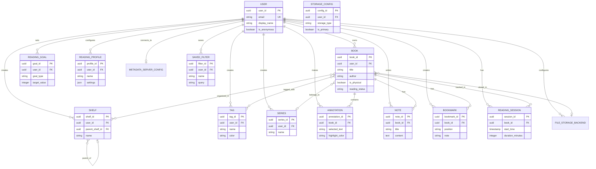

# Entities

This section defines the data model entities for Papyrus. These entities form the foundation for the database schema and represent the core data structures managed by the application.

## Entity Overview

| Entity | Description | Related Requirements |
|--------|-------------|---------------------|
| User | System user account | FR-1.x |
| Book | Physical or digital book | FR-2.x, FR-3.x |
| Shelf | User-defined book collection | FR-2.9 |
| Tag | Color-coded book label | FR-2.10 |
| Series | Book series grouping | FR-2.2 |
| Annotation | Text highlight with note | FR-4.1 |
| Note | Free-form book note | FR-4.2 |
| Bookmark | Saved position in book | FR-3.4 |
| ReadingSession | Reading activity record | FR-5.1 |
| ReadingGoal | Reading objective | FR-6.x |
| ReadingProfile | Viewer customization preset | FR-3.3 |
| MetadataServerConfig | Sync server connection | FR-7.1.1 |
| FileStorageBackend | File storage backend settings | FR-7.1 |
| SavedFilter | Saved search/filter query | FR-2.11 |

---

## Entity Relationship Diagram



---

## Core Entities

### User

Represents a person who uses the system.

**Attributes:**

| Attribute | Type | Constraints | Description |
|-----------|------|-------------|-------------|
| user_id | UUID | PK | Unique identifier |
| email | String | Unique, nullable | User's email (null for anonymous) |
| password_hash | String | Nullable | Encrypted password (null for OAuth) |
| display_name | String | Required | User's preferred name |
| avatar_url | String | Nullable | Profile image URL |
| google_id | String | Unique, nullable | Google OAuth identifier |
| is_anonymous | Boolean | Default: false | Anonymous user flag |
| is_active | Boolean | Default: true | Account status |
| email_verified | Boolean | Default: false | Email verification status |
| created_at | Timestamp | Auto | Account creation time |
| updated_at | Timestamp | Auto | Last update time |
| last_login_at | Timestamp | Nullable | Last login time |
| preferences | JSON | Default: {} | User preferences |

**Relationships:**

- One-to-many with Book, Shelf, Tag, Series
- One-to-many with Annotation, Note, Bookmark
- One-to-many with ReadingSession, ReadingGoal
- One-to-many with ReadingProfile, FileStorageBackend, SavedFilter
- One-to-one with MetadataServerConfig (optional)

---

### Book

Represents a physical or digital book in the user's library.

**Attributes:**

| Attribute | Type | Constraints | Description |
|-----------|------|-------------|-------------|
| book_id | UUID | PK | Unique identifier |
| user_id | UUID | FK → User | Book owner |
| title | String | Required | Book title |
| subtitle | String | Nullable | Book subtitle |
| author | String | Required | Primary author |
| co_authors | JSON | Default: [] | Additional authors |
| isbn | String | Nullable | ISBN-10 |
| isbn13 | String | Nullable | ISBN-13 |
| publication_date | Date | Nullable | Publication date |
| publisher | String | Nullable | Publisher name |
| language | String | Default: 'en' | Language code (ISO 639-1) |
| page_count | Integer | Nullable | Total pages |
| description | Text | Nullable | Book summary |
| cover_image_url | String | Nullable | Cover image path/URL |
| series_id | UUID | FK → Series, nullable | Series reference |
| series_number | Decimal | Nullable | Position in series |
| file_path | String | Nullable | Digital file path (relative to storage) |
| file_format | String | Nullable | File format (EPUB, PDF, etc.) |
| file_size | BigInt | Nullable | File size in bytes |
| file_hash | String | Nullable | File checksum (SHA-256) |
| storage_backend_id | UUID | FK → FileStorageBackend, nullable | Storage location |
| is_physical | Boolean | Default: false | Physical book flag |
| physical_location | String | Nullable | Physical storage location |
| lent_to | String | Nullable | Borrower info |
| lent_at | Timestamp | Nullable | Lending date |
| is_favorite | Boolean | Default: false | Favorite flag |
| rating | Integer | Range: 1-5, nullable | User rating |
| reading_status | Enum | not_started, in_progress, completed, paused, abandoned | Current status |
| current_page | Integer | Nullable | Current page (physical) |
| current_position | Decimal | Range: 0-1, nullable | Reading position (digital) |
| current_cfi | String | Nullable | EPUB CFI position |
| started_at | Timestamp | Nullable | Reading start date |
| completed_at | Timestamp | Nullable | Completion date |
| added_at | Timestamp | Auto | Date added to library |
| last_read_at | Timestamp | Nullable | Last reading session |
| custom_metadata | JSON | Default: {} | User-defined fields |
| is_ocr_processed | Boolean | Default: false | OCR status |
| ocr_confidence | Decimal | Range: 0-1, nullable | OCR quality score |

**Relationships:**

- Many-to-one with User (owner)
- Many-to-one with Series (optional)
- Many-to-one with FileStorageBackend (optional, for digital books)
- Many-to-many with Shelf
- Many-to-many with Tag
- One-to-many with Annotation, Note, Bookmark, ReadingSession

**Indexes:**

- user_id (for library queries)
- title, author (for search)
- reading_status (for filtering)
- series_id (for series grouping)
- storage_backend_id (for storage queries)

---

### Shelf

Represents a user-created collection for organizing books.

**Attributes:**

| Attribute | Type | Constraints | Description |
|-----------|------|-------------|-------------|
| shelf_id | UUID | PK | Unique identifier |
| user_id | UUID | FK → User | Shelf owner |
| parent_shelf_id | UUID | FK → Shelf, nullable | Parent for nesting |
| name | String | Required | Shelf name |
| description | Text | Nullable | Shelf description |
| color | String | Nullable | Display color (hex) |
| icon | String | Nullable | Display icon name |
| is_default | Boolean | Default: false | System default shelf |
| is_smart | Boolean | Default: false | Dynamic/smart shelf |
| smart_query | String | Nullable | Query for smart shelves |
| sort_order | Integer | Default: 0 | Display order |
| created_at | Timestamp | Auto | Creation time |
| updated_at | Timestamp | Auto | Last update time |

**Relationships:**

- Many-to-one with User (owner)
- Many-to-one with Shelf (parent, for nesting)
- One-to-many with Shelf (children)
- Many-to-many with Book

**Default Shelves:**

- "Currently Reading" (is_default: true)
- "Want to Read" (is_default: true)
- "Finished" (is_default: true)

---

### Tag

Represents a color-coded label for categorizing books.

**Attributes:**

| Attribute | Type | Constraints | Description |
|-----------|------|-------------|-------------|
| tag_id | UUID | PK | Unique identifier |
| user_id | UUID | FK → User | Tag owner |
| name | String | Required | Tag name |
| color | String | Required | Tag color (hex) |
| description | Text | Nullable | Tag description |
| usage_count | Integer | Default: 0 | Number of books with tag |
| created_at | Timestamp | Auto | Creation time |

**Relationships:**

- Many-to-one with User (owner)
- Many-to-many with Book

**Constraints:**

- Maximum 10 tags per book
- Tag name unique per user

---

### Series

Represents a book series (e.g., "Harry Potter", "Lord of the Rings").

**Attributes:**

| Attribute | Type | Constraints | Description |
|-----------|------|-------------|-------------|
| series_id | UUID | PK | Unique identifier |
| user_id | UUID | FK → User | Series owner |
| name | String | Required | Series name |
| description | Text | Nullable | Series description |
| author | String | Nullable | Primary series author |
| total_books | Integer | Nullable | Expected total books |
| is_complete | Boolean | Default: false | Series completion flag |
| created_at | Timestamp | Auto | Creation time |
| updated_at | Timestamp | Auto | Last update time |

**Relationships:**

- Many-to-one with User (owner)
- One-to-many with Book

---

### Annotation

Represents a text highlight with optional note in a digital book.

**Attributes:**

| Attribute | Type | Constraints | Description |
|-----------|------|-------------|-------------|
| annotation_id | UUID | PK | Unique identifier |
| book_id | UUID | FK → Book | Associated book |
| user_id | UUID | FK → User | Annotation creator |
| selected_text | Text | Required | Highlighted text |
| note | Text | Nullable | User's note |
| highlight_color | String | Required | Highlight color (hex) |
| start_position | String | Required | Selection start (CFI/offset) |
| end_position | String | Required | Selection end |
| chapter_title | String | Nullable | Chapter name |
| chapter_index | Integer | Nullable | Chapter number |
| page_number | Integer | Nullable | Page (for PDF) |
| created_at | Timestamp | Auto | Creation time |
| updated_at | Timestamp | Auto | Last update time |

**Relationships:**

- Many-to-one with Book
- Many-to-one with User

**Highlight Colors (defaults):**

- Yellow (#FFEB3B)
- Green (#4CAF50)
- Blue (#2196F3)
- Pink (#E91E63)
- Orange (#FF9800)

---

### Note

Represents a free-form note associated with a book.

**Attributes:**

| Attribute | Type | Constraints | Description |
|-----------|------|-------------|-------------|
| note_id | UUID | PK | Unique identifier |
| book_id | UUID | FK → Book | Associated book |
| user_id | UUID | FK → User | Note creator |
| title | String | Required | Note title |
| content | Text | Required | Note content (Markdown) |
| is_pinned | Boolean | Default: false | Pinned note flag |
| created_at | Timestamp | Auto | Creation time |
| updated_at | Timestamp | Auto | Last update time |

**Relationships:**

- Many-to-one with Book
- Many-to-one with User

---

### Bookmark

Represents a saved position within a book for quick navigation.

**Attributes:**

| Attribute | Type | Constraints | Description |
|-----------|------|-------------|-------------|
| bookmark_id | UUID | PK | Unique identifier |
| book_id | UUID | FK → Book | Associated book |
| user_id | UUID | FK → User | Bookmark creator |
| position | String | Required | Position (CFI/page/offset) |
| page_number | Integer | Nullable | Page number (for display) |
| chapter_title | String | Nullable | Chapter name |
| note | String | Nullable | Optional note |
| color | String | Default: '#FF5722' | Bookmark color |
| created_at | Timestamp | Auto | Creation time |

**Relationships:**

- Many-to-one with Book
- Many-to-one with User

---

### ReadingSession

Represents a period of reading activity.

**Attributes:**

| Attribute | Type | Constraints | Description |
|-----------|------|-------------|-------------|
| session_id | UUID | PK | Unique identifier |
| book_id | UUID | FK → Book | Book being read |
| user_id | UUID | FK → User | Reader |
| start_time | Timestamp | Required | Session start |
| end_time | Timestamp | Nullable | Session end (null if active) |
| start_position | Decimal | Nullable | Position at start |
| end_position | Decimal | Nullable | Position at end |
| pages_read | Integer | Nullable | Pages read |
| duration_minutes | Integer | Calculated | Total reading time |
| device_type | String | Nullable | Device used |
| device_name | String | Nullable | Device identifier |
| created_at | Timestamp | Auto | Record creation time |

**Relationships:**

- Many-to-one with Book
- Many-to-one with User

---

### ReadingGoal

Represents a user-defined reading objective.

**Attributes:**

| Attribute | Type | Constraints | Description |
|-----------|------|-------------|-------------|
| goal_id | UUID | PK | Unique identifier |
| user_id | UUID | FK → User | Goal owner |
| title | String | Required | Goal name |
| description | Text | Nullable | Goal description |
| goal_type | Enum | books_count, pages_count, reading_time | Goal metric |
| target_value | Integer | Required, > 0 | Target number |
| current_value | Integer | Default: 0 | Current progress |
| time_period | Enum | daily, weekly, monthly, yearly, custom | Goal duration type |
| start_date | Date | Required | Goal start |
| end_date | Date | Required | Goal end |
| is_active | Boolean | Default: true | Active status |
| is_completed | Boolean | Default: false | Completion status |
| completed_at | Timestamp | Nullable | Completion time |
| created_at | Timestamp | Auto | Creation time |
| updated_at | Timestamp | Auto | Last update time |

**Relationships:**

- Many-to-one with User

---

### ReadingProfile

Represents saved reader customization settings.

**Attributes:**

| Attribute | Type | Constraints | Description |
|-----------|------|-------------|-------------|
| profile_id | UUID | PK | Unique identifier |
| user_id | UUID | FK → User | Profile owner |
| name | String | Required | Profile name |
| is_default | Boolean | Default: false | Default profile flag |
| font_family | String | Default: 'Georgia' | Font name |
| font_size | Integer | Range: 8-72, Default: 16 | Font size (pt) |
| font_weight | Integer | Default: 400 | Font weight |
| line_height | Decimal | Default: 1.5 | Line spacing |
| letter_spacing | Decimal | Default: 0 | Letter spacing |
| paragraph_spacing | Decimal | Default: 1.0 | Paragraph spacing |
| text_align | Enum | left, right, center, justify | Text alignment |
| margin_horizontal | Integer | Default: 20 | Horizontal margin (px) |
| margin_vertical | Integer | Default: 20 | Vertical margin (px) |
| background_color | String | Default: '#FFFFFF' | Background (hex) |
| text_color | String | Default: '#000000' | Text color (hex) |
| link_color | String | Default: '#0066CC' | Link color (hex) |
| selection_color | String | Default: '#B3D4FC' | Selection color (hex) |
| theme_mode | Enum | light, dark, sepia, custom | Theme preset |
| reading_mode | Enum | paginated, continuous | Scroll mode |
| page_turn_animation | Boolean | Default: true | Animation enabled |
| column_count | Integer | Default: 1 | Column layout |
| hyphenation | Boolean | Default: true | Hyphenation enabled |
| created_at | Timestamp | Auto | Creation time |
| updated_at | Timestamp | Auto | Last update time |

**Relationships:**

- Many-to-one with User

**Suggested Profiles:**

- "Day" - Light background, dark text
- "Night" - Dark background, light text
- "Sepia" - Warm tones for reduced eye strain
- "E-ink" - High contrast, no animations

---

### MetadataServerConfig

Represents the user's connection to a metadata server for cross-device synchronization. Each user has at most one active metadata server connection.

**Attributes:**

| Attribute | Type | Constraints | Description |
|-----------|------|-------------|-------------|
| config_id | UUID | PK | Unique identifier |
| user_id | UUID | FK → User, Unique | Config owner (one per user) |
| server_url | String | Required | Metadata server URL |
| server_type | Enum | official, self_hosted | Server type |
| auth_token | String | Encrypted | JWT or API token |
| refresh_token | String | Encrypted, nullable | Refresh token |
| is_connected | Boolean | Default: false | Connection status |
| sync_enabled | Boolean | Default: true | Auto-sync enabled |
| sync_interval_seconds | Integer | Default: 30 | Sync frequency |
| last_sync_at | Timestamp | Nullable | Last successful sync |
| sync_status | Enum | idle, syncing, error | Current sync state |
| sync_error_message | String | Nullable | Last error message |
| created_at | Timestamp | Auto | Creation time |
| updated_at | Timestamp | Auto | Last update time |

**Relationships:**

- One-to-one with User

**Notes:**

- If null, user is in local-only mode (no sync)
- Server URL validated on save
- See [Server Architecture](server-architecture.md) for details

---

### FileStorageBackend

Represents a configured file storage backend where book files are stored. Users can have multiple backends.

**Attributes:**

| Attribute | Type | Constraints | Description |
|-----------|------|-------------|-------------|
| backend_id | UUID | PK | Unique identifier |
| user_id | UUID | FK → User | Backend owner |
| backend_type | Enum | local, google_drive, onedrive, dropbox, webdav, minio, s3, papyrus_server | Backend type |
| name | String | Required | Display name |
| is_primary | Boolean | Default: false | Primary backend for uploads |
| is_active | Boolean | Default: true | Enabled status |
| connection_config | JSON | Encrypted | Type-specific connection settings |
| credentials | JSON | Encrypted, nullable | OAuth tokens or API keys |
| base_path | String | Nullable | Root directory/bucket |
| storage_used_bytes | BigInt | Nullable | Bytes used |
| storage_quota_bytes | BigInt | Nullable | Total capacity |
| last_accessed_at | Timestamp | Nullable | Last file access |
| connection_status | Enum | connected, disconnected, error | Current status |
| error_message | String | Nullable | Last error |
| created_at | Timestamp | Auto | Creation time |
| updated_at | Timestamp | Auto | Last update time |

**Relationships:**

- Many-to-one with User
- One-to-many with Book (books reference storage backend)

**Connection Config Examples:**

```json
// Google Drive
{
  "folder_id": "abc123",
  "folder_path": "/Papyrus/Books"
}

// WebDAV
{
  "server_url": "https://nextcloud.example.com/remote.php/dav/files/user/",
  "folder_path": "/Papyrus/Books"
}

// MinIO/S3
{
  "endpoint": "https://minio.example.com",
  "bucket": "papyrus-books",
  "region": "us-east-1"
}

// Papyrus Server
{
  "server_url": "https://papyrus.example.com"
}
```

**Notes:**

- Only one backend can be primary at a time
- Local backend always exists (implicit)
- See [Server Architecture](server-architecture.md) for details

---

### SavedFilter

Represents a saved search or filter query for reuse.

**Attributes:**

| Attribute | Type | Constraints | Description |
|-----------|------|-------------|-------------|
| filter_id | UUID | PK | Unique identifier |
| user_id | UUID | FK → User | Filter owner |
| name | String | Required | Filter display name |
| description | Text | Nullable | Filter description |
| query | String | Required | Filter query string |
| filter_type | Enum | search, shelf, custom | Filter category |
| icon | String | Nullable | Display icon |
| color | String | Nullable | Display color |
| is_pinned | Boolean | Default: false | Pinned to sidebar |
| usage_count | Integer | Default: 0 | Times used |
| last_used_at | Timestamp | Nullable | Last usage time |
| created_at | Timestamp | Auto | Creation time |
| updated_at | Timestamp | Auto | Last update time |

**Relationships:**

- Many-to-one with User

**Query Language Examples:**

- `author:"Isaac Asimov" AND year:>1970`
- `tag:science-fiction OR tag:fantasy`
- `status:in_progress AND rating:>=4`
- `shelf:"Currently Reading" AND format:epub`

---

## Junction Tables

### BookShelf

Many-to-many relationship between Book and Shelf.

| Attribute | Type | Constraints |
|-----------|------|-------------|
| book_id | UUID | FK → Book, PK |
| shelf_id | UUID | FK → Shelf, PK |
| added_at | Timestamp | Auto |
| sort_order | Integer | Default: 0 |

### BookTag

Many-to-many relationship between Book and Tag.

| Attribute | Type | Constraints |
|-----------|------|-------------|
| book_id | UUID | FK → Book, PK |
| tag_id | UUID | FK → Tag, PK |
| created_at | Timestamp | Auto |

---

## Entity Relationships Summary

### By Functional Area

**User Management**

- User owns all other entities through user_id foreign key
- User can be anonymous (no email) or registered

**Book Organization**

- Books belong to Shelves (many-to-many)
- Books have Tags (many-to-many, max 10)
- Books can belong to a Series (many-to-one)
- Shelves can be nested (self-referential)

**Reading Experience**

- Books have Annotations (one-to-many)
- Books have Notes (one-to-many)
- Books have Bookmarks (one-to-many)
- Users have ReadingProfiles (one-to-many)

**Progress & Goals**

- Books have ReadingSessions (one-to-many)
- Users have ReadingGoals (one-to-many)

**Configuration**

- Users have MetadataServerConfig (one-to-one, optional)
- Users have FileStorageBackends (one-to-many)
- Users have SavedFilters (one-to-many)
- Books reference FileStorageBackend (many-to-one)

### Data Integrity Rules

1. **Cascade Delete**: When User is deleted, all owned entities are deleted
2. **Nullify**: When Series is deleted, Book.series_id is set to null
3. **Restrict**: Cannot delete Shelf/Tag while books are associated
4. **Unique Constraints**:
   - User email must be unique
   - Tag name unique per user
   - Shelf name unique within parent
