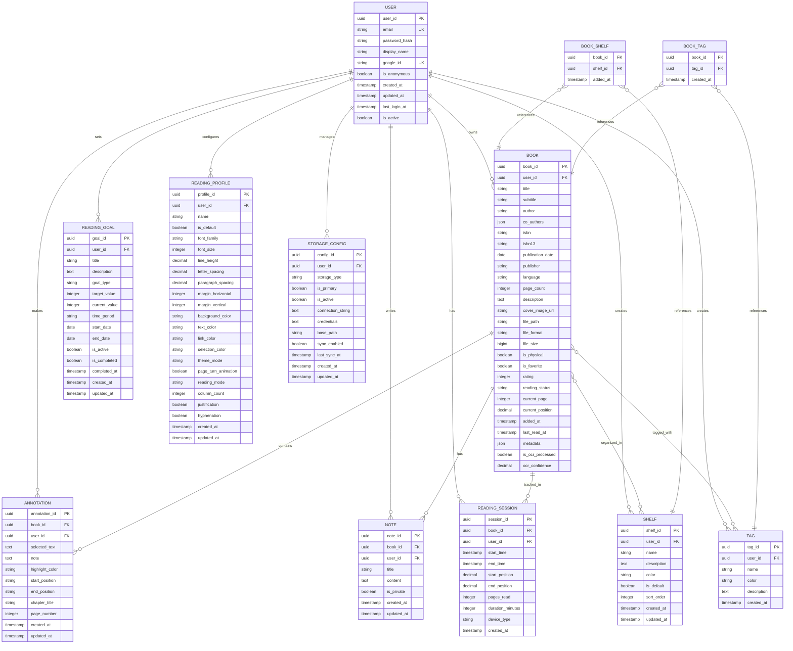

# Database model

This section presents the database schema design for the system, showing the relationships between entities and their attributes. The model is designed to support cross-platform synchronization, flexible storage options, and comprehensive book management features.

## Database schema overview

The database consists of several interconnected tables that support the core functionality:

- **User management**: User accounts with support for anonymous, email/password, and OAuth authentication
- **Book management**: Flexible book storage with metadata, physical/digital distinction, and file handling
- **Organization**: Shelves and tags for book categorization
- **Reading experience**: Annotations, notes, reading sessions, and customizable profiles
- **Goal tracking**: Reading goals and progress monitoring
- **Storage configuration**: Multiple storage backend support

## Entity relationship diagram

## Key design principles

### Data integrity
- **Foreign key constraints**: Ensure referential integrity across all relationships
- **Unique constraints**: Prevent duplicate user emails, shelf names per user, etc.
- **Check constraints**: Validate data ranges (ratings 1-5, positions 0-1, etc.)
- **NOT NULL constraints**: Ensure required fields are always populated

### Performance optimization
- **Primary indexes**: UUID primary keys with automatic indexing
- **Foreign key indexes**: Automatic indexing on all foreign key relationships
- **Search indexes**: Full-text search capabilities on book content and metadata
- **Composite indexes**: Multi-column indexes for common query patterns

### Scalability considerations
- **UUID identifiers**: Support for distributed systems and data migration
- **JSON fields**: Flexible metadata storage without schema changes
- **Nullable fields**: Support for incomplete data and gradual data entry
- **Audit fields**: Created/updated timestamps for all entities

### Data types and constraints

**Common patterns:**
- **Primary Keys**: UUID for global uniqueness and distribution support
- **Timestamps**: With timezone support for global user base
- **Text fields**: Varying lengths based on expected content size
- **Boolean flags**: Clear true/false states with appropriate defaults
- **JSON fields**: Flexible storage for metadata and configuration

**Validation rules:**
- Email addresses must be unique across users
- Book ratings must be between 1 and 5
- Reading positions must be between 0.0 and 1.0
- Goal target values must be positive integers
- Font sizes must be within reasonable ranges (8-72)

### Migration strategy

The database schema is designed to support incremental updates and migrations:

- **Version tracking**: Schema version table for migration management
- **Backward compatibility**: New fields are nullable to support gradual rollouts
- **Index management**: Indexes can be added/removed without data loss
- **Data preservation**: Migration scripts preserve existing user data

This database model provides a robust foundation for the system while maintaining flexibility for future enhancements and ensuring data integrity across all operations.

