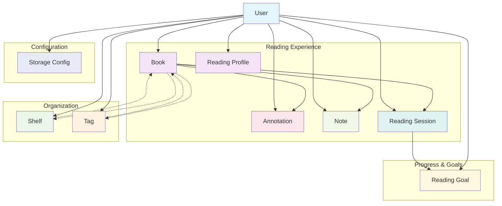

# Entities

This section defines the core entities that make up the system. These entities form the foundation for the database model and represent the main data structures that the application manages.

## Entity relationship overview

The following diagram illustrates how the main entities interact within the system:

**Legend:**
- Solid arrows (→) represent direct ownership relationships
- Dotted arrows (-.→) represent many-to-many associations
- Color coding groups related functionality areas

## Core entities

### User
Represents a person who uses the system.

**Attributes:**
- `user_id` (Primary Key): Unique identifier
- `email`: User's email address (unique, nullable for anonymous users)
- `password_hash`: Encrypted password (nullable for OAuth users)
- `display_name`: User's preferred display name
- `google_id`: Google OAuth identifier (nullable)
- `is_anonymous`: Boolean indicating anonymous user status
- `created_at`: Account creation timestamp
- `updated_at`: Last profile update timestamp
- `last_login_at`: Last login timestamp
- `is_active`: Account status flag

**Relationships:**
- One-to-many with Book (owns books)
- One-to-many with Shelf (creates shelves)
- One-to-many with ReadingGoal
- One-to-many with ReadingSession
- One-to-many with Annotation
- One-to-many with Note
- One-to-many with ReadingProfile

### Book
Represents a book (physical or digital) in the user's library.

**Attributes:**
- `book_id` (Primary Key): Unique identifier
- `user_id` (Foreign Key): Owner of the book
- `title`: Book title
- `subtitle`: Book subtitle (nullable)
- `author`: Primary author name
- `co_authors`: Additional authors (JSON array)
- `isbn`: International Standard Book Number (nullable)
- `isbn13`: 13-digit ISBN (nullable)
- `publication_date`: Book publication date (nullable)
- `publisher`: Publishing company (nullable)
- `language`: Book language code
- `page_count`: Total number of pages (nullable)
- `description`: Book description or summary (nullable)
- `cover_image_url`: URL or path to cover image (nullable)
- `file_path`: Path to digital book file (nullable for physical books)
- `file_format`: Digital file format (EPUB, PDF, etc.) (nullable)
- `file_size`: File size in bytes (nullable)
- `is_physical`: Boolean indicating if book is physical
- `is_favorite`: User's favorite status
- `rating`: User's rating (1-5 stars) (nullable)
- `reading_status`: Current reading status (enum: not_started, in_progress, completed, paused)
- `current_page`: Current reading position for physical books (nullable)
- `current_position`: Current reading position for digital books (percentage or location)
- `added_at`: Date when book was added to library
- `last_read_at`: Last reading session timestamp (nullable)
- `metadata`: Additional metadata (JSON object)
- `is_ocr_processed`: Boolean indicating OCR processing status
- `ocr_confidence`: OCR accuracy confidence score (nullable)

**Relationships:**
- Many-to-one with User (belongs to user)
- Many-to-many with Shelf (can be in multiple shelves)
- Many-to-many with Tag (can have multiple tags)
- One-to-many with Annotation
- One-to-many with Note
- One-to-many with ReadingSession

### Shelf
Represents a user-created collection or category for organizing books.

**Attributes:**
- `shelf_id` (Primary Key): Unique identifier
- `user_id` (Foreign Key): Owner of the shelf
- `name`: Shelf name
- `description`: Shelf description (nullable)
- `color`: Shelf color for UI display (nullable)
- `is_default`: Boolean indicating if this is a default shelf
- `sort_order`: User-defined sorting order
- `created_at`: Shelf creation timestamp
- `updated_at`: Last modification timestamp

**Relationships:**
- Many-to-one with User (belongs to user)
- Many-to-many with Book (contains books)

### Tag
Represents a label that can be applied to books for organization and filtering.

**Attributes:**
- `tag_id` (Primary Key): Unique identifier
- `user_id` (Foreign Key): Creator of the tag
- `name`: Tag name
- `color`: Tag color (hex code)
- `description`: Tag description (nullable)
- `created_at`: Tag creation timestamp

**Relationships:**
- Many-to-one with User (belongs to user)
- Many-to-many with Book (can be applied to multiple books)

### Annotation
Represents highlights and notes made on specific text within digital books.

**Attributes:**
- `annotation_id` (Primary Key): Unique identifier
- `book_id` (Foreign Key): Book containing the annotation
- `user_id` (Foreign Key): Creator of the annotation
- `selected_text`: The highlighted text content
- `note`: Optional note content (nullable)
- `highlight_color`: Color used for highlighting
- `start_position`: Start position of selection in book
- `end_position`: End position of selection in book
- `chapter_title`: Chapter or section title (nullable)
- `page_number`: Page number (for PDF books) (nullable)
- `created_at`: Annotation creation timestamp
- `updated_at`: Last modification timestamp

**Relationships:**
- Many-to-one with Book (belongs to book)
- Many-to-one with User (created by user)

### Note
Represents free-form notes associated with books but not tied to specific text.

**Attributes:**
- `note_id` (Primary Key): Unique identifier
- `book_id` (Foreign Key): Associated book
- `user_id` (Foreign Key): Note creator
- `title`: Note title
- `content`: Note content (text/markdown)
- `is_private`: Privacy flag for future sharing features
- `created_at`: Note creation timestamp
- `updated_at`: Last modification timestamp

**Relationships:**
- Many-to-one with Book (belongs to book)
- Many-to-one with User (created by user)

### ReadingSession
Represents a period of reading activity for tracking progress and statistics.

**Attributes:**
- `session_id` (Primary Key): Unique identifier
- `book_id` (Foreign Key): Book being read
- `user_id` (Foreign Key): Reader
- `start_time`: Session start timestamp
- `end_time`: Session end timestamp (nullable for active sessions)
- `start_position`: Reading position at session start
- `end_position`: Reading position at session end (nullable)
- `pages_read`: Number of pages read during session (nullable)
- `duration_minutes`: Total reading time in minutes (calculated)
- `device_type`: Type of device used (mobile, desktop, web, etc.)
- `created_at`: Session record creation timestamp

**Relationships:**
- Many-to-one with Book (reading session for book)
- Many-to-one with User (reader)

### ReadingGoal
Represents user-defined reading objectives and targets.

**Attributes:**
- `goal_id` (Primary Key): Unique identifier
- `user_id` (Foreign Key): Goal owner
- `title`: Goal title/name
- `description`: Goal description (nullable)
- `goal_type`: Type of goal (enum: books_count, pages_count, reading_time)
- `target_value`: Target number (books, pages, or minutes)
- `current_value`: Current progress value
- `time_period`: Goal time frame (enum: weekly, monthly, quarterly, yearly, custom)
- `start_date`: Goal start date
- `end_date`: Goal end date
- `is_active`: Goal status flag
- `is_completed`: Completion status flag
- `completed_at`: Completion timestamp (nullable)
- `created_at`: Goal creation timestamp
- `updated_at`: Last progress update timestamp

**Relationships:**
- Many-to-one with User (belongs to user)

### ReadingProfile
Represents saved reading preferences and viewer customization settings.

**Attributes:**
- `profile_id` (Primary Key): Unique identifier
- `user_id` (Foreign Key): Profile owner
- `name`: Profile name
- `is_default`: Boolean indicating if this is the default profile
- `font_family`: Font family name
- `font_size`: Font size in points
- `line_height`: Line spacing multiplier
- `letter_spacing`: Letter spacing value
- `paragraph_spacing`: Paragraph spacing value
- `margin_horizontal`: Horizontal page margins
- `margin_vertical`: Vertical page margins
- `background_color`: Background color (hex code)
- `text_color`: Text color (hex code)
- `link_color`: Link color (hex code)
- `selection_color`: Text selection color (hex code)
- `theme_mode`: Theme mode (enum: light, dark, sepia, custom)
- `page_turn_animation`: Page turning animation preference
- `reading_mode`: Reading mode (enum: paginated, continuous_scroll)
- `column_count`: Number of columns for wide screens
- `justification`: Text justification preference
- `hyphenation`: Hyphenation enabled flag
- `created_at`: Profile creation timestamp
- `updated_at`: Last modification timestamp

**Relationships:**
- Many-to-one with User (belongs to user)

### StorageConfig
Represents user's storage backend configuration for file management.

**Attributes:**
- `config_id` (Primary Key): Unique identifier
- `user_id` (Foreign Key): Configuration owner
- `storage_type`: Storage backend type (enum: local, google_drive, onedrive, minio, self_hosted)
- `is_primary`: Boolean indicating if this is the primary storage
- `is_active`: Configuration status flag
- `connection_string`: Encrypted connection parameters (JSON)
- `credentials`: Encrypted authentication credentials (JSON)
- `base_path`: Base directory path for book storage (nullable)
- `sync_enabled`: Synchronization enabled flag
- `last_sync_at`: Last synchronization timestamp (nullable)
- `created_at`: Configuration creation timestamp
- `updated_at`: Last modification timestamp

**Relationships:**
- Many-to-one with User (belongs to user)

## Entity relationships summary

The entity relationships form a comprehensive model that supports:

1. **User management**: Anonymous and registered users with different capabilities
2. **Book organization**: Flexible categorization through shelves and tags
3. **Reading experience**: Customizable profiles and comprehensive progress tracking
4. **Content interaction**: Annotations and notes for enhanced reading
5. **Goal setting**: Motivational features through reading goals
6. **Data flexibility**: Multiple storage backends and synchronization options

This entity model ensures data integrity while providing the flexibility needed for a cross-platform book management system that respects user data ownership and privacy preferences.

