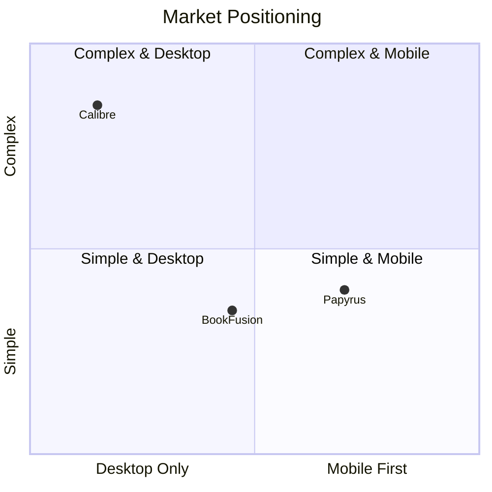

# Market Analysis

This section provides market research, competitive analysis, and positioning strategy for Papyrus.

## Executive Summary

Papyrus enters the e-book management market with a focus on **user data ownership**, **cross-platform consistency**, and **privacy-first design**. Unlike existing solutions that lock users into ecosystems or require subscriptions, Papyrus provides a free, open-source alternative that respects user privacy and works across all devices.

---

## Target Audience

### Primary Users

**1. Avid Digital Readers**

- Read 10+ books per year
- Use multiple devices (phone, tablet, e-reader, computer)
- Frustrated with ecosystem lock-in (Kindle, Kobo)
- Want to own their book files

**2. Privacy-Conscious Users**

- Prefer local-first applications
- Avoid cloud services with tracking
- Want control over their data
- May self-host services

**3. E-ink Device Owners**

- Use dedicated e-readers (Kobo, Boox, etc.)
- Want a unified library across devices
- Need optimized reading experience
- Value battery efficiency

**4. Organized Readers**

- Large book collections (500+ books)
- Need powerful organization tools
- Track reading progress and habits
- Set and achieve reading goals

### Secondary Users

**5. Students and Researchers**

- Heavy annotation and note-taking
- Need to export highlights
- Organize by topics/courses
- Reference and citation needs

**6. Book Clubs**

- Shared reading lists
- Discussion coordination
- Progress tracking

---

## Competitive Landscape

### Direct Competitors

| Product | Strengths | Weaknesses |
|---------|-----------|------------|
| **Calibre** | Powerful, free, open-source | Complex UI, desktop-only, steep learning curve |
| **BookFusion** | Cross-platform, good UI | Subscription required, cloud-dependent |
| **Moon+ Reader** | Feature-rich Android app | Android-only, no sync |
| **KOReader** | Open-source, e-ink optimized | Limited platforms, technical setup |

### Ecosystem Players

| Platform | Lock-in | Cross-platform | Notes |
|----------|---------|----------------|-------|
| **Amazon Kindle** | High | Yes (apps) | Proprietary format, tracking |
| **Apple Books** | High | Apple only | No export, iOS/macOS only |
| **Google Play Books** | Medium | Yes | Cloud-only, limited features |
| **Kobo** | Medium | Limited | Better DRM-free support |

### Feature Comparison

| Feature | Papyrus | Calibre | BookFusion | Kindle |
|---------|---------|---------|------------|--------|
| Cross-platform | Yes | Desktop only | Yes | Yes |
| Offline-first | Yes | Yes | No | Partial |
| Open source | Yes | Yes | No | No |
| Self-hostable | Yes | N/A | No | No |
| E-ink optimized | Yes | No | No | Yes |
| No subscription | Yes | Yes | No | Yes |
| Privacy-first | Yes | Yes | No | No |
| Format conversion | Yes | Yes | Limited | No |
| Annotations export | Yes | Yes | Yes | Limited |
| Reading stats | Yes | Limited | Yes | Yes |

---

## Market Opportunities

### Gap Analysis

**1. Unified Cross-Platform Experience**

- Most solutions are platform-specific or web-only
- Users want consistent experience across all devices
- Opportunity: Single app for Android, iOS, Web, Desktop, E-ink

**2. Privacy and Data Ownership**

- Growing concern about data tracking
- Users want control over their reading data
- Opportunity: Local-first with optional self-hosted sync

**3. E-ink Device Support**

- Existing apps poorly optimized for e-ink
- E-ink market growing (Boox, reMarkable, etc.)
- Opportunity: First-class e-ink support

**4. Open Standards**

- Proprietary formats limit user freedom
- DRM frustrates legitimate users
- Opportunity: Focus on open formats (EPUB)

**5. Modern User Experience**

- Calibre is powerful but dated UI
- Most alternatives are basic
- Opportunity: Modern, intuitive interface

### Market Trends

- **E-reader growth**: E-ink device market expanding beyond Kindle
- **Privacy awareness**: Post-GDPR users care about data control
- **Self-hosting renaissance**: Growing interest in self-hosted services
- **Remote work**: More reading time, need for organization
- **Subscription fatigue**: Users resisting yet another subscription

---

## Positioning Strategy

### Value Proposition

> **Papyrus: Your books, your data, every device.**
>
> A free, open-source e-book manager that works everywhere you read. No subscriptions, no tracking, no lock-in.

### Key Differentiators

1. **True cross-platform**: One app for all devices including e-ink
2. **Offline-first**: Full functionality without internet
3. **Privacy by default**: No analytics, no tracking
4. **Data ownership**: Export everything, self-host if desired
5. **Modern UX**: Clean, intuitive Material 3 design
6. **Open source**: Transparent, community-driven development

### Target Positioning

**Positioning Notes:**

- **Calibre**: Powerful but complex, desktop-only
- **BookFusion**: Cross-platform but subscription-based
- **Papyrus (target)**: Mobile-first, simple UX, cross-platform

---

## Go-to-Market Strategy

### Phase 1: Foundation (MVP)

**Target**: Early adopters, Calibre users wanting mobile access

**Features**:

- Core reading and library management
- Local-only operation
- Android and iOS apps
- Web app

**Channels**:

- GitHub releases
- Reddit (r/ebooks, r/selfhosted, r/kindle)
- Hacker News
- Tech blogs

### Phase 2: Growth

**Target**: Mainstream readers, privacy-conscious users

**Features**:

- Cross-device sync
- Cloud storage integration
- E-ink optimization
- Reading goals

**Channels**:

- App stores (Google Play, Apple App Store)
- Social media presence
- Partnerships with e-ink device makers
- Content marketing (reading tips, book organization)

### Phase 3: Expansion

**Target**: Power users, institutions

**Features**:

- Plugin ecosystem
- Team/family features
- Advanced analytics
- API for developers

**Channels**:

- Enterprise outreach
- Educational institutions
- Developer community

---

## Risk Analysis

| Risk | Probability | Impact | Mitigation |
|------|-------------|--------|------------|
| Limited adoption | Medium | High | Focus on niche first, iterate based on feedback |
| Competition from big players | Low | Medium | Differentiate on privacy and openness |
| E-book format changes | Low | Medium | Modular format support, community plugins |
| Funding sustainability | Medium | High | Open-source donations, optional premium features |
| Technical complexity | Medium | Medium | Prioritize MVP, iterate quickly |

---

## Success Metrics

### User Metrics

| Metric | Target (Year 1) |
|--------|-----------------|
| Monthly Active Users | 10,000 |
| Daily Active Users | 2,500 |
| Books managed | 500,000 |
| User retention (30-day) | 40% |

### Engagement Metrics

| Metric | Target |
|--------|--------|
| Reading sessions/user/week | 5 |
| Books completed/user/year | 8 |
| Annotations/user | 50 |
| App store rating | 4.5+ |

### Community Metrics

| Metric | Target |
|--------|--------|
| GitHub stars | 1,000 |
| Contributors | 25 |
| Plugin developers | 10 |
| Translations | 10 languages |

---

## Conclusion

Papyrus has a clear opportunity in the e-book management market by addressing unmet needs:

1. **Cross-platform consistency** that ecosystem players can't provide
2. **Privacy and data ownership** that cloud services don't prioritize
3. **Modern UX** that Calibre lacks
4. **E-ink support** that mobile apps ignore

By focusing on these differentiators and targeting privacy-conscious, multi-device readers first, Papyrus can establish a loyal user base before expanding to mainstream adoption.
